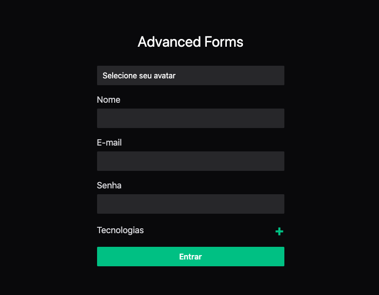
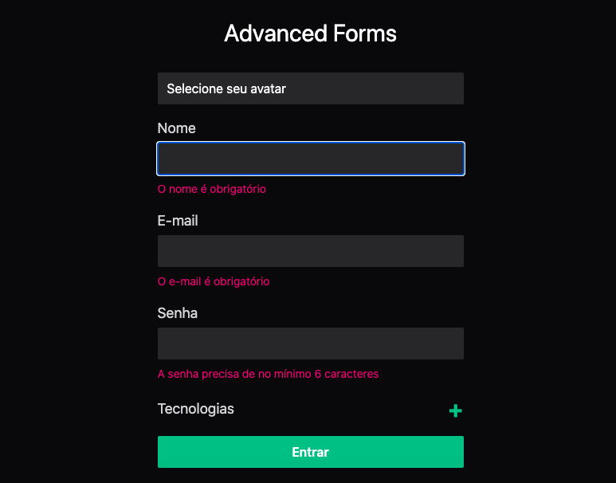

# Advanced Forms

<p>
Forma avançada de usar formulários no ReactJS
</p>

# Screens

<p align="center">
  
  
</p>

[✔] Validação / Transformção
[✔] Field arrays
[✔] Upload de arquivos

## Technologies used

- [ReactJS](https://pt-br.reactjs.org)
- [Vite](https://vitejs.dev)
- [Typescript](https://www.typescriptlang.org)
- [Tailwindcss](https://tailwindcss.com)
- [React Hook Form](https://react-hook-form.com)
- [Zod](https://zod.dev/)
- [Supabase](https://supabase.com)

## Requirements

You need to install [Node.js](https://nodejs.org)

## How to use it

## SUPABASE_CONFIG


```bash
VITE_SUPABASE_URL=
VITE_SUPABASE_SECRET=
```


```bash
# Install the dependencies
$ npm install
# Run the web server
$ npm run dev
```

The app will be available for access on your browser at (http://localhost:5173)
